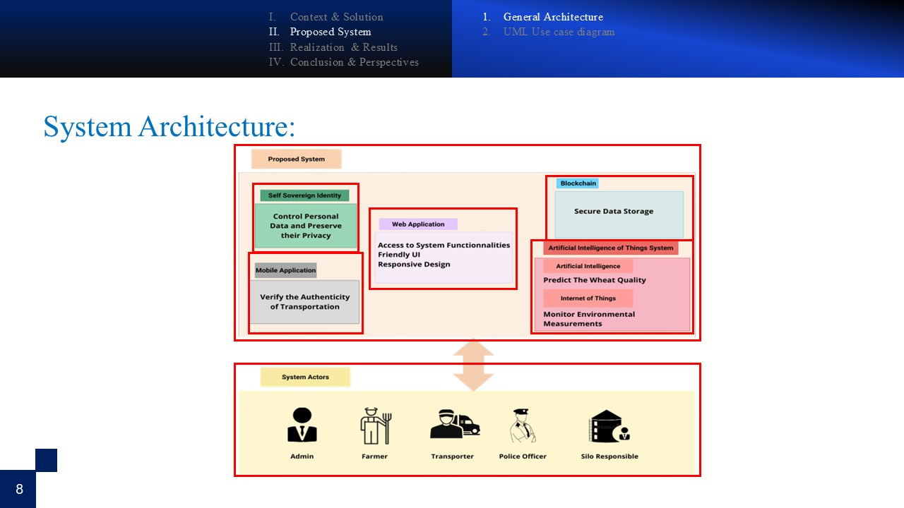
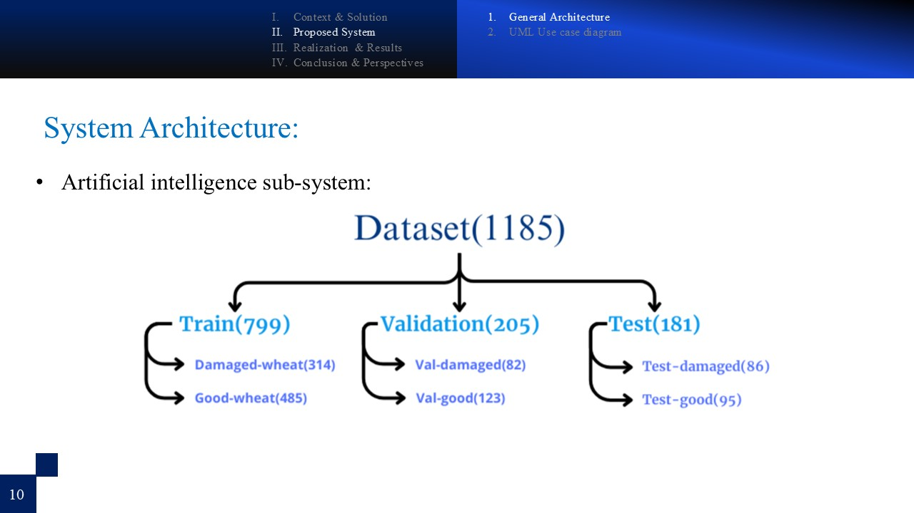

The presentation slides are stored in the **presentation/** folder.

## Presentation
### Slides

  
  
  
  
  
  
  
  
  
  
  
  
  
  
  
  
  
  
  
  
  
  
  
  
  
  
  
  
  
  
  
  
  
  
